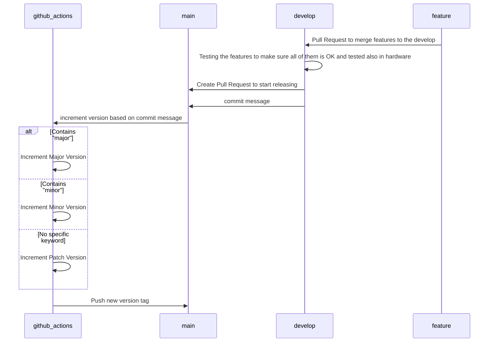

# Biometric RFID Access Firmware CI/CD

So, in here we use Gitlab Actions as our runner to run the CI/CD Pipeline. The cycle for this CI/CD Pipeline is like this  
1. We first going to merge our feature branch to the develop branch
2. After that, after we test and making sure there's nothing wrong with it, the repository owner or the responsible moderator can start versioning the project by Pull request to the main
3. In this CI/CD, the process is not so automatic, where the versioning will following the SemVer or Semantic Versioning v1.2.3 or Major.Minor.Patch. So the versioning will be controlled from us (the repository owner or the one who merged the code to main) by the git commit message of the Pull Request form from `develop` to `main`
4. After we versioning our project based on major, minor, and patch. Build process will be triggered on the `build.yml` and if success it will release a new version of the firmware project.

Here's below the diagram for visualization of the CI/CD process

## Setup
For CI/CD to work, there's things need to be done in order first. But before if it's not clear enough. Github Actions can triggered the CI/CD Build pipeline by checking wether there's a `.yml` in the folder of `.github/workflows`. If there is, it will check the content of inside the rule of how to run the CI/CD process. In here, the CI/CD will only be triggered whenever there's a new push(signed by new commit or new PR request to main). So, the setups for this is really easy
1. So, in order to give Github Actions some mandate, we need to give them user access, which is the PAT or Personal Access Token. To do this, go to `Settings` --> `Developer Setttings` --> `Personal access tokens`
2. Just choose Token classic for now, where you can choose to generate a new token. For the access the basic one is repo, workflow, codespace, and project so our Github Actions can bypass the main branch protection rule. After you make the token, save that and move on to the next one

Now we need to configure that token to be included to our Github Actions CI/CD pipeline process  
1. Go the your repository project and go the the repository settings
2. Open the `Security` --> `Actions`
3. Then open the Secrets tabs and choose to make new repository secret
4. Make new one under name `GH_PAT` and copy the token you just obtained to the secret key form. You can choose any name for the secret, but this will do for now
5. Save the secret and you finished the setup. To actually use them in the workflow `yml`, you can use the `{{ secrets }}` keyword, for an example to access the `GH_PATH` is `{{ secrets.GH_PATH }}`

And that's it for the setup for preparation to run the CI/CD Pipeline on Github Actions. Hope this helps as reminder

## Author
Muhammad Juniarto  
(Signed)